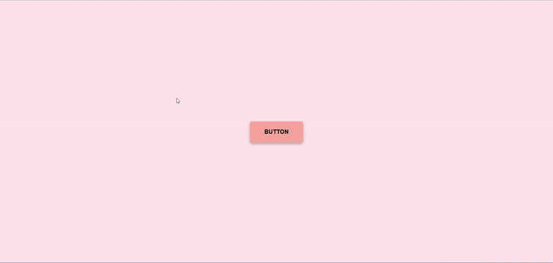
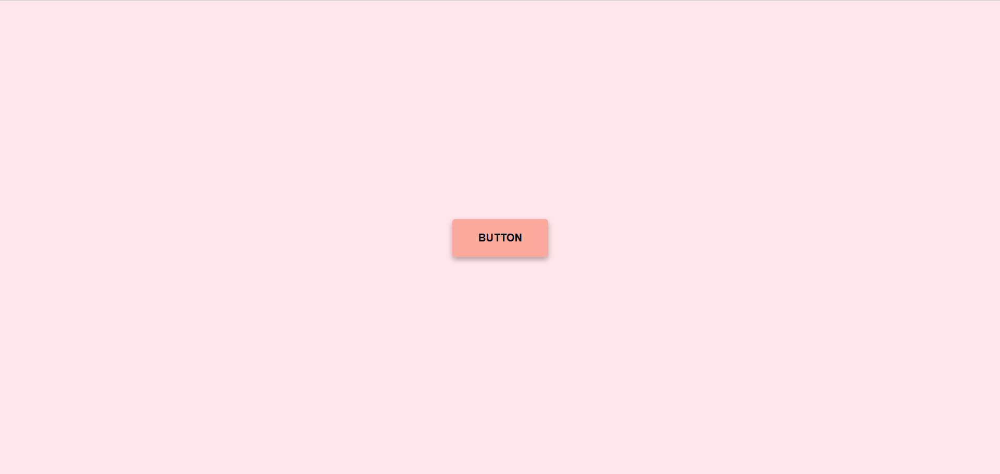
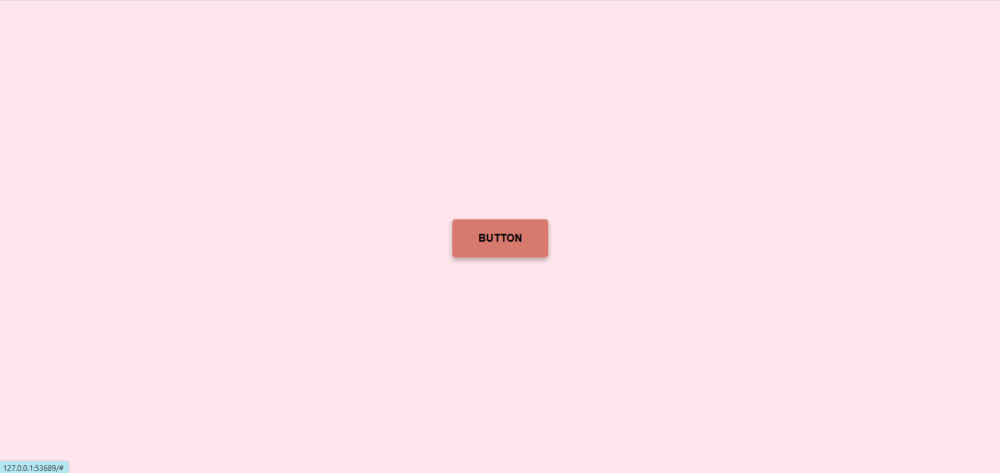

# VeilView

**VeilView** is a lightweight and modern UI component for creating elegant popups with a blurred background. Designed for focus, clarity, and minimal distraction, VeilView helps you enhance user interaction through subtle UI depth and style.

---

## 🚀 Profile 
<a href="https://www.linkedin.com/in/dharmendraverma95/" target="_blank">🧑‍💻 LinkedIn Profile </a> | <a href="https://www.behance.net/dhirukumar" target="_blank">🧑‍💻 Behance Profile </a>

---

## ✨ Features

- 🔍 Blurred background (glassmorphism) effect
- 💡 Focused foreground modal for clean UX
- 📱 Fully responsive and mobile-friendly
- ⚡ Lightweight and easy to integrate
- 🎨 Customizable styles with pure HTML/CSS

---

## 🎨 Customization
- You can easily customize:
- Blur intensity
- Modal size and position
- Colors, shadows, and transitions
- Modify veilview.css to suit your design.

👉 Desktop Design 

👉 Desktop Design 

